<div align="center">

# ⚡ GreenPulse Energy Management System


[](https://python.org)
[](https://flask.palletsprojects.com/)
[](https://tensorflow.org)
[](https://pytorch.org)
[](LICENSE)

**An intelligent energy management platform that leverages AI/ML to optimize renewable energy distribution, predict consumption patterns, and maximize grid efficiency in real-time.**

[🚀 Quick Start](#-quick-start) • [📊 Features](#-features) • [🏗️ Architecture](#️-system-architecture) • [📖 Documentation](#-documentation)

</div>

---

## 🌟 Project Overview

**GreenPulse** is a cutting-edge energy management system designed to revolutionize how we interact with renewable energy sources. By combining advanced machine learning models with an intuitive real-time dashboard, GreenPulse empowers users to:

- 🔮 **Forecast Energy Demand** with 95%+ accuracy using LSTM neural networks
- ☀️ **Predict Solar Generation** based on real-time weather conditions and irradiance
- 🌬️ **Estimate Wind Power** output using meteorological data analysis
- 🔋 **Optimize Battery Storage** to balance supply and demand dynamically
- 📈 **Maximize Grid Export** earnings while minimizing import costs
- 🌍 **Track CO₂ Reduction** and environmental impact metrics

---

## 🎯 Key Features

<table>
<tr>
<td width="50%">

### 🤖 AI-Powered Predictions
- **LSTM Neural Networks** for demand forecasting
- **PyTorch Solar Model** with 6-feature analysis
- **Scikit-learn Wind Model** with weather integration
- **Real-time Model Updates** as new data arrives

</td>
<td width="50%">

### 📊 Interactive Dashboard
- **Live Energy Visualization** with animated charts
- **Real-time KPI Monitoring** (Solar, Wind, Battery, Grid)
- **Historical & Forecast Views** with trend analysis
- **Dark/Light Theme** support with smooth transitions

</td>
</tr>
<tr>
<td width="50%">

### ⚙️ Smart Energy Management
- **Dynamic Battery Control** with configurable priorities
- **Grid Import/Export Optimization** for cost savings
- **Scenario Simulation** (Peak, Off-Peak, Emergency)
- **Weather-Responsive Adjustments** in real-time

</td>
<td width="50%">

### 💰 Economic Insights
- **Grid Export Earnings** calculator with ROI tracking
- **Import Cost Monitoring** with usage analytics
- **CO₂ Reduction Metrics** and environmental impact
- **Performance Benchmarking** against optimal scenarios

</td>
</tr>
</table>

---

## 🏗️ System Architecture

### Energy Flow Diagram

```mermaid
%%{init: {'theme':'base', 'themeVariables': { 'primaryColor':'#10b981','primaryTextColor':'#fff','primaryBorderColor':'#059669','lineColor':'#ffffffff','secondaryColor':'#fbbf24','tertiaryColor':'#0D1117'}}}%%

flowchart TB
    subgraph "⚡ ENERGY SOURCES"
        A1[☀️ Solar Panels<br/>340 kW Max]
        A2[🌬️ Wind Turbines<br/>160 kW Max]
        A3[🔌 Grid Import<br/>Variable]
    end
    
    subgraph "🧠 AI PREDICTION ENGINE"
        B1[📊 LSTM Demand Model<br/>24hr Sequence Analysis]
        B2[🌤️ Solar LSTM Model<br/>Weather + Irradiance]
        B3[💨 Wind ML Model<br/>Speed + Cloud Coverage]
    end
    
    subgraph "🎛️ ENERGY MANAGEMENT CORE"
        C1[⚖️ Load Balancer<br/>Priority-Based Distribution]
        C2[🔋 Battery Controller<br/>55 kWh Storage]
        C3[📈 Optimization Engine<br/>Cost & Efficiency]
    end
    
    subgraph "📊 CONSUMPTION & EXPORT"
        D1[🏭 Site Load<br/>6 kW Base]
        D2[⬆️ Grid Export<br/>Sell Surplus]
        D3[💾 Data Logger<br/>CSV Storage]
    end
    
    subgraph "🖥️ USER INTERFACE"
        E1[📱 Real-time Dashboard<br/>Live Monitoring]
        E2[📉 Analytics & Trends<br/>Historical + Forecast]
        E3[⚙️ Control Panel<br/>Scenario Simulation]
    end

    A1 --> C1
    A2 --> C1
    A3 --> C1
    
    B1 -.->|Predictions| C3
    B2 -.->|Predictions| C3
    B3 -.->|Predictions| C3
    
    C1 --> C2
    C2 --> C1
    C1 --> D1
    C1 --> D2
    
    C3 --> C1
    D3 --> B1
    D3 --> B2
    D3 --> B3
    
    E1 --> C3
    E2 --> D3
    E3 --> C1
    
    D1 -.->|Usage Data| D3
    D2 -.->|Export Data| D3
    C2 -.->|Battery State| E1

    style A1 fill:#fbbf24,stroke:#d97706,stroke-width:2px,color:#000
    style A2 fill:#22d3ee,stroke:#0891b2,stroke-width:2px,color:#000
    style A3 fill:#a855f7,stroke:#7e22ce,stroke-width:2px,color:#fff
    style C2 fill:#10b981,stroke:#059669,stroke-width:2px,color:#fff
    style D1 fill:#ef4444,stroke:#dc2626,stroke-width:2px,color:#fff
    style D2 fill:#8b5cf6,stroke:#7c3aed,stroke-width:2px,color:#fff
```



### Data Flow Architecture

```mermaid
%%{init: {'theme':'base', 'themeVariables': { 'primaryColor':'#2563eb','primaryTextColor':'#fff','primaryBorderColor':'#1d4ed8'}}}%%

sequenceDiagram
    participant U as 👤 User
    participant F as 🌐 Frontend (JS)
    participant B as ⚙️ Flask Backend
    participant M as 🤖 ML Models
    participant D as 💾 CSV Database
    
    U->>F: Upload historical CSV
    F->>B: POST /api/upload_csv
    B->>D: Store 24hr+ data
    B-->>F: ✅ Upload successful
    
    U->>F: Start Simulation
    F->>F: Initialize tick loop
    
    loop Every Tick (Hourly)
        F->>B: POST /api/tick (current params)
        B->>D: Append new row
        B-->>F: ✅ Tick recorded
        
        F->>B: POST /api/predict
        B->>D: Fetch last 24 rows
        B->>M: Run LSTM Demand Model
        B->>M: Run Solar LSTM Model
        B->>M: Run Wind ML Model
        M-->>B: Return predictions
        B-->>F: Solar, Wind, Demand forecast
        
        F->>F: Update energy balance
        F->>F: Calculate battery state
        F->>F: Optimize grid import/export
        F->>U: 📊 Update dashboard UI
    end
    
    U->>F: Adjust controls (sliders)
    F->>F: Recalculate energy flow
    F->>U: 🔄 Real-time UI update
```



---

## 🚀 Quick Start

### Prerequisites

Before you begin, ensure you have the following installed:
- **Python 3.8+** ([Download](https://www.python.org/downloads/))
- **pip** (comes with Python)
- **Git** (optional, for cloning)

### Installation Steps

<details open>
<summary><b>📥 Step 1: Clone or Download the Repository</b></summary>

```bash
# Using Git
git clone https://github.com/Alapan18/green-pulse
cd green-pulse

# Or download and extract the ZIP file
```

</details>

<details open>
<summary><b>🐍 Step 2: Create a Virtual Environment</b></summary>

Creating a virtual environment isolates your project dependencies from your system Python installation.

**Windows (PowerShell):**
```powershell
python -m venv venv
.\venv\Scripts\Activate.ps1
```

**Windows (Command Prompt):**
```cmd
python -m venv venv
venv\Scripts\activate.bat
```

**macOS/Linux:**
```bash
python3 -m venv venv
source venv/bin/activate
```

✅ You should see `(venv)` prefix in your terminal prompt.

</details>

<details open>
<summary><b>📦 Step 3: Install Dependencies</b></summary>

Install all required Python packages from `requirements.txt`:

```bash
pip install --upgrade pip
pip install -r requirements.txt
```

**Expected packages:**
- Flask 3.0.0 (Web framework)
- TensorFlow 2.15.0 (LSTM demand model)
- PyTorch 2.1.0 (Solar prediction model)
- Scikit-learn 1.3.2 (Wind prediction model)
- NumPy, Pandas (Data processing)
- Additional utilities

⏱️ Installation may take 5-10 minutes depending on your internet speed.

</details>

<details open>
<summary><b>🚀 Step 4: Run the Application</b></summary>

Start the Flask development server:

```bash
python app.py
```

You should see output similar to:
```
 * Running on http://127.0.0.1:5000
 * Debug mode: on
```

🌐 Open your browser and navigate to: **http://localhost:5000**

</details>

<details open>
<summary><b>📊 Step 5: Upload Historical Data</b></summary>

1. Prepare a CSV file with **at least 24 hours** of historical data
2. Required columns (case-insensitive):
   - `date` (format: DDMMYYYY, e.g., 25092025)
   - `time` (hour: 0-23)
   - `consumption` (kW)
   - `holiday` (0 or 1)
   - `wind_speed` (m/s)
   - `cloud_coverage` (%)
   - `temperature` (°C)
   - `irradiance` (W/m²)
3. Click **"Choose File"** and select your CSV
4. Click **"Upload"** to initialize the system

</details>

<details open>
<summary><b>▶️ Step 6: Start the Simulation</b></summary>

1. Click the **"▶️ Start Simulation"** button
2. Watch real-time predictions update every tick
3. Adjust sliders to simulate different conditions:
   - Site Load (Consumption)
   - Wind Speed
   - Cloud Coverage
   - Temperature
   - Solar Irradiance
   - Holiday Mode

4. Monitor KPIs: Solar, Wind, Battery, Grid Export, Import
5. View Analytics & Trends in the tabs below

</details>

---

## 📁 Project Structure

```
greenpulse-v2/
│
├── 📄 app.py                          # Flask backend server & API endpoints
├── 📄 requirements.txt                # Python dependencies
├── 📄 runtime.txt                     # Python runtime version (for deployment)
├── 📄 history.csv                     # Historical data accumulation
├── 📄 README.md                       # This file
│
├── 📁 models/                         # Pre-trained ML models & scalers
│   ├── 📁 demand/
│   │   ├── demand_forecast_model.h5   # Keras LSTM model (24hr sequence)
│   │   └── consumption_scaler.pkl     # MinMaxScaler for demand
│   ├── 📁 solar/
│   │   ├── lstm_solar_model.pth       # PyTorch LSTM model (6 features)
│   │   ├── solar_features_scaler.pkl  # Input feature scaler
│   │   └── solar_target_scaler.pkl    # Output target scaler
│   └── 📁 wind/
│       ├── wind_forecast_model.pkl    # Scikit-learn regression model
│       └── wind_features_scaler.pkl   # Wind feature scaler
│
├── 📁 data/                           # Data directory (created at runtime)
│   └── data.csv                       # Server-side CSV (appended on each tick)
│
├── 📁 static/                         # Frontend assets
│   ├── 📄 app.js                      # JavaScript logic (EMS class, charts, controls)
│   └── 📄 style.css                   # Styling (glass cards, animations, themes)
│
└── 📁 templates/                      # HTML templates
    └── 📄 index.html                  # Main dashboard UI
```

---

## 🧠 Machine Learning Models

### 1. 📊 Demand Forecasting (LSTM)
- **Architecture:** TensorFlow/Keras LSTM with 24-hour sequence input
- **Features:** Scaled consumption, day, time, holiday flag
- **Output:** Next hour energy demand prediction
- **Accuracy:** ~95% on test data

### 2. ☀️ Solar Generation (PyTorch LSTM)
- **Architecture:** 2-layer LSTM (64 hidden units) with 6 input features
- **Features:** Day, month, time, temperature, irradiance, cloud coverage
- **Output:** Solar power generation (0-340 kW)
- **Special Logic:** Zero generation enforced before 4 AM and after 6 PM

### 3. 🌬️ Wind Generation (Scikit-learn)
- **Algorithm:** Gradient Boosting / Random Forest Regressor
- **Features:** Day, month, time, wind speed, cloud coverage
- **Output:** Wind power generation (0-160 kW)
- **Threshold:** Low generation (<5 kW) when wind speed < 5 m/s

---

## ⚙️ Configuration & Customization

### Energy Parameters
Edit these constants in `app.js` or adjust via the dashboard:

| Parameter | Default | Range | Description |
|-----------|---------|-------|-------------|
| **Solar Max** | 340 kW | - | Maximum solar panel capacity |
| **Wind Max** | 160 kW | - | Maximum wind turbine capacity |
| **Battery Capacity** | 55 kWh | - | Total battery storage |
| **Battery Reserve** | 20% | 0-50% | Minimum battery reserve level |
| **Site Load** | 6 kW | 1-20 kW | Base consumption demand |
| **Grid Rate (Export)** | ₹6/kWh | - | Selling price to grid |
| **Grid Rate (Import)** | ₹8/kWh | - | Buying price from grid |

### Dashboard Controls
- **Battery Priority Slider:** Balance between charging and grid export (0-100%)
- **Grid Import Slider:** Manual control for grid import percentage
- **Scenario Buttons:** Quick presets (Peak Hours, Off-Peak, Emergency)
- **Optimize Button:** AI-driven parameter optimization
- **Theme Toggle:** Switch between light and dark modes

---

## 📊 API Reference

### `POST /api/upload_csv`
Upload historical energy data (minimum 24 rows).

**Request:**
- `Content-Type: multipart/form-data`
- `file`: CSV file with required columns

**Response:**
```json
{
  "ok": true,
  "last_date": "2025-09-25",
  "last_time": 23,
  "rows": 168
}
```

### `POST /api/tick`
Record a new hourly data point.

**Request Body:**
```json
{
  "date": "25092025",
  "time": 14,
  "consumption": 8.5,
  "holiday": 0,
  "wind_speed": 7.2,
  "cloud_coverage": 30,
  "temperature": 28,
  "irradiance": 850
}
```

### `POST /api/predict`
Generate predictions using the last 24 hours of data.

**Response:**
```json
{
  "solar_gen": 285.34,
  "wind_gen": 92.15,
  "demand_forecast": 7.82
}
```

---

## 🎨 Dashboard Overview

### Main Sections

1. **⚡ Energy KPIs**
   - Solar Generation (real-time + predicted)
   - Wind Generation (real-time + predicted)
   - Battery State of Charge (%)
   - Total Generation (Solar + Wind)
   - Grid Export (surplus energy sold)

2. **🎛️ Control Panel**
   - Site Load slider
   - Weather condition sliders (wind, clouds, temp, irradiance)
   - Holiday mode toggle
   - Scenario quick-action buttons

3. **📈 Analytics & Trends**
   - **Real-time Tab:** Live energy flow visualization
   - **Forecast Tab:** Next 24-hour predictions
   - **Historical Tab:** Past week's performance

4. **💰 Economic Insights**
   - CO₂ reduction tracker
   - Grid export earnings (cumulative)
   - Grid import costs
   - Cost savings vs. full grid reliance

5. **🤖 AI Recommendations**
   - Next-hour predictions (Solar, Wind, Demand)
   - Strategic suggestions for optimization
   - Weather alerts and generation forecasts

---

## 🌍 Environmental Impact

**GreenPulse** helps track and maximize your positive environmental impact:

- **CO₂ Reduction:** ~0.7 kg avoided per kWh of renewable energy used
- **Real-time Tracking:** Cumulative CO₂ savings displayed on dashboard
- **Export Benefits:** Surplus renewable energy feeds back into the grid
- **Optimization:** AI ensures maximum renewable utilization

**Example:** A system generating 500 kWh/day from solar+wind avoids **~350 kg CO₂ daily** compared to fossil fuel sources.

---

## 🛠️ Troubleshooting

<details>
<summary><b>❌ "No module named 'tensorflow'" or similar errors</b></summary>

**Solution:** Ensure your virtual environment is activated and dependencies are installed:
```bash
# Activate venv first
.\venv\Scripts\Activate.ps1  # Windows PowerShell
pip install -r requirements.txt
```

</details>

<details>
<summary><b>❌ "No data on server. Upload CSV first."</b></summary>

**Solution:** You must upload a valid CSV with at least 24 rows before starting the simulation. Check that your CSV has all required columns.

</details>

<details>
<summary><b>❌ Models not loading / predictions returning errors</b></summary>

**Solution:** Verify that the `models/` directory exists with all required files:
- `models/demand/demand_forecast_model.h5`
- `models/solar/lstm_solar_model.pth`
- `models/wind/wind_forecast_model.pkl`
- Associated scaler `.pkl` files

</details>

<details>
<summary><b>❌ Port 5000 already in use</b></summary>

**Solution:** Change the port in `app.py`:
```python
if __name__ == '__main__':
    app.run(debug=True, port=5001)  # Use different port
```

</details>

<details>
<summary><b>⚠️ Simulation runs but predictions are zero</b></summary>

**Solution:** 
1. Ensure your CSV has realistic values (not all zeros)
2. Check that time values are 0-23
3. For solar: time must be 4-18 for generation
4. For wind: wind_speed should be ≥ 5 m/s for significant output

</details>

---

## 🚀 Deployment

### Heroku Deployment

1. Create a `Procfile`:
```
web: gunicorn app:app
```

2. Deploy:
```bash
heroku create your-app-name
git push heroku main
```

### Docker Deployment

1. Create `Dockerfile`:
```dockerfile
FROM python:3.9-slim
WORKDIR /app
COPY requirements.txt .
RUN pip install -r requirements.txt
COPY . .
EXPOSE 5000
CMD ["python", "app.py"]
```

2. Build and run:
```bash
docker build -t greenpulse .
docker run -p 5000:5000 greenpulse
```

---

## 🤝 Contributing

Contributions are welcome! Here's how you can help:

1. 🍴 Fork the repository
2. 🌿 Create a feature branch (`git checkout -b feature/AmazingFeature`)
3. 💾 Commit your changes (`git commit -m 'Add some AmazingFeature'`)
4. 📤 Push to the branch (`git push origin feature/AmazingFeature`)
5. 🔀 Open a Pull Request

### Development Guidelines
- Follow PEP 8 style guide for Python code
- Add comments for complex logic
- Test ML model changes thoroughly
- Update documentation for new features

---

## 📜 License

This project is licensed under the **MIT License** - see the [LICENSE](LICENSE) file for details.

---

## 👨‍💻 Author

**Developers of the Green-pulse Team**

<br/>
<html>
<table align="center" border="0" cellpadding="0" cellspacing="0">
  <tr>
    <!-- Alapan -->
    <td align="center" valign="top" width="30%" style="padding: 20px;">
      <div style="background-color:#667eea; padding: 25px; border-radius: 20px; box-shadow: 0 4px 15px rgba(0,0,0,0.2);">
        <a href="https://www.linkedin.com/in/mr-alapan-pradhan">
          
        </a>
        <br/><br/>
        <h3 style="color:#ffffff; margin:10px 0;">Alapan Pradhan</h3>
        <br/>
        <a href="https://github.com/Alapan18">
          
        </a>
        <a href="https://www.linkedin.com/in/mr-alapan-pradhan">
          
        </a>
      </div>
    </td>
    <td align="center" valign="top" width="30%" style="padding: 20px;">
      <div style="background-color:#f5576c; padding: 25px; border-radius: 20px; box-shadow: 0 4px 15px rgba(0,0,0,0.2);">
        <a href="https://www.linkedin.com/in/samirroydev/">
          
        </a>
        <br/><br/>
        <h3 style="color:#ffffff; margin:10px 0;">Samir Roy</h3>
        <br/>
        <a href="https://github.com/SamirRoy929">
          
        </a>
        <a href="https://www.linkedin.com/in/samirroydev/">
          
        </a>
      </div>
    </td>
    <td align="center" valign="top" width="30%" style="padding: 20px;">
      <div style="background-color:#00aaff; padding: 25px; border-radius: 20px; box-shadow: 0 4px 15px rgba(0,0,0,0.2);">
        <a href="http://www.linkedin.com/in/diganta-das-955730315/">
          
        </a>
        <br/><br/>
        <h3 style="color:#ffffff; margin:10px 0;">Diganta Das</h3>
        <br/>
        <a href="https://github.com/YOUR_GITHUB_USERNAME_HERE">
          
        </a>
        <a href="http://www.linkedin.com/in/diganta-das-955730315/">
          
        </a>
      </div>
    </td>
  </tr>
</table>

</html>
<br/>

---

### 📬 Contact Information

- 📧 Email: alapan.pradhan.1@gmail.com, roysamir929@gmail.com, ddass12340987@gmail.com
- 💼 LinkedIn: [Alapan Pradhan](www.linkedin.com/in/mr-alapan-pradhan) • [Samir Roy](https://www.linkedin.com/in/samirroydev/) • [Diganta Das](http://www.linkedin.com/in/diganta-das-955730315/)
- 🐙 GitHub: [@Alapan18](https://github.com/Alapan18/) • [@SamirRoy929](https://github.com/SamirRoy929)

---

## 🙏 Acknowledgments

- **TensorFlow** for the powerful LSTM framework
- **PyTorch** for flexible neural network tools
- **Scikit-learn** for classical ML algorithms
- **Flask** for the lightweight web framework
- **Open-source Community** for continuous inspiration

---

## 📞 Support

Need help? Here's how to get support:

- 🐛 [Open an Issue](https://github.com/Alapan18/green-pulse/issues)
- 📧 Email: alapan.pradhan.1@gmail.com, roysamir929@gmail.com, ddass12340987@gmail.com

---

<div align="center">

### ⭐ Star this repository if you find it helpful!

**Made with 💚 for a sustainable future**

[](https://github.com/yourusername/greenpulse-v2/stargazers)
[](https://github.com/yourusername/greenpulse-v2/network/members)
[](https://github.com/yourusername/greenpulse-v2/issues)

---

**🌱 Together, let's power a greener tomorrow with intelligent energy management! 🌍**

</div>
